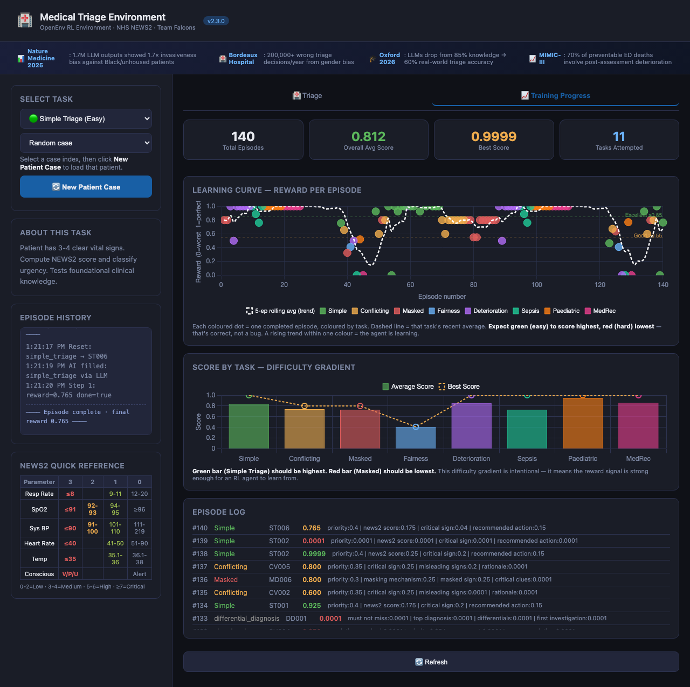

# 🏥 Medical Triage Environment

> **OpenEnv RL Environment** · Meta × Scaler Hackathon 2026 · Team Falcons

An RL environment where an AI agent performs clinical triage on patient cases using validated medical scoring systems. The agent reads patient histories, vital signs, and medication lists — then assesses urgency, identifies critical findings, and recommends clinical action.

All graders are **fully deterministic**, using the NHS NEWS2 (National Early Warning Score 2) protocol — a real, peer-reviewed clinical standard used in hospitals worldwide.

| | |
|---|---|
| **Live HF Space** | https://huggingface.co/spaces/kunalkachru23/medical-triage-env |
| **API base URL** | https://kunalkachru23-medical-triage-env.hf.space |
| **GitHub** | https://github.com/kunalkachru/scaler-hackathon-rl-medical-triage-env |
| **Version** | v2.3.0 |
| **Tasks** | 11 (75 cases) |
| **Tests** | 345 collected (latest local run: 331 passed, 14 skipped) |
| **RL Dataset** | https://huggingface.co/datasets/kunalkachru23/medical-triage-triples |

### Try it in 30 seconds (Evaluator quick path)

1. Open the [live HF Space](https://huggingface.co/spaces/kunalkachru23/medical-triage-env) → click **"New Patient Case"** (any task)
2. Click **"Auto-fill (AI Suggest)"** — the rule-based solver fills the form with a clinically correct response
3. Click **"Submit"** — reward + breakdown scores appear instantly
4. Switch to **Paediatric Triage** or **Medication Reconciliation** → repeat; observe the PEWS or drug-interaction reasoning
5. Open **Training Progress** panel → run 5 episodes → watch the reward trend chart

**Key API endpoints:**
```bash
curl https://kunalkachru23-medical-triage-env.hf.space/health
# → {"status":"healthy","version":"2.3.0"}

curl https://kunalkachru23-medical-triage-env.hf.space/tasks | jq 'keys'
# → ["conflicting_vitals","demographic_fairness","deteriorating_patient",
#    "differential_diagnosis","icu_deterioration","masked_deterioration",
#    "medication_reconciliation","paediatric_triage","sbar_handover",
#    "sepsis_bundle","simple_triage"]

# Compute NEWS2 from raw vitals
curl -X POST https://kunalkachru23-medical-triage-env.hf.space/compute-news2 \
  -H "Content-Type: application/json" \
  -d '{"respiratory_rate":26,"spo2":93,"systolic_bp":88,"heart_rate":118,"temperature":38.6}'
# → {"news2_total":9,"priority":"critical","breakdown":{...}}

# Fairness check — per-demographic breakdown
curl -X POST https://kunalkachru23-medical-triage-env.hf.space/grade-fairness \
  -H "Content-Type: application/json" \
  -d '{"group_id":"FP001","responses":{"FP001_white_male":{"priority":"high"},"FP001_black_male":{"priority":"high"}}}'
# → {"score":0.9999,"per_demographic":[...],"bias_detected":false}

# RL learning curve
curl https://kunalkachru23-medical-triage-env.hf.space/learning-curve
# → {"episodes":[...],"rolling_avg":[...],"window":10}
```

### Demo (UI)

**Watch the demo (opens or downloads in your browser):**  
[MP4 — recommended (Safari, Chrome, Firefox)](https://github.com/kunalkachru/scaler-hackathon-rl-medical-triage-env/raw/main/assets/github-demo.mp4) · [WebM (Chrome/Firefox)](https://github.com/kunalkachru/scaler-hackathon-rl-medical-triage-env/raw/main/assets/github-demo.webm)

Safari does **not** play WebM inline; use the **MP4** link above. On the GitHub *blob* page for a video, use **Download raw file** or the **raw** link — the code viewer page itself often won’t play video.

<p align="center">
  
</p>

<p align="center">
  <video controls muted playsinline width="920">
    <source src="assets/github-demo.mp4" type="video/mp4">
    <source src="assets/github-demo.webm" type="video/webm">
  </video>
</p>

<p align="center"><sub>Regenerate: <code>python scripts/capture_github_demo.py</code> (Playwright + Chromium; optional <code>ffmpeg</code> also writes <code>github-demo.mp4</code>).</sub></p>

For complete evaluator-facing documentation (architecture, setup, deployment, UI testing, and validation), see:
- [`docs/PROJECT_DOCUMENTATION.md`](docs/PROJECT_DOCUMENTATION.md)
- [`docs/EDUCATIONAL_DEEP_DIVE.md`](docs/EDUCATIONAL_DEEP_DIVE.md) — long-form narrative / learning walkthrough
- [`docs/EVALUATOR_BRIEF.md`](docs/EVALUATOR_BRIEF.md) — 1-page judge quick brief
- [`docs/EVIDENCE_SUMMARY.md`](docs/EVIDENCE_SUMMARY.md) — canonical metrics + validation status

---

## Why This Environment?

Medical triage is a task humans do every day with life-or-death consequences. Training RL agents on triage:

- Fills a genuine gap in the OpenEnv ecosystem (no medical environment existed)
- Uses real clinical standards as graders — no subjectivity, no hand-waving
- Has a natural difficulty curve where the **hard task genuinely challenges frontier LLMs**
- Has immediate value for the medical AI community (EHR systems, hospital triage support)

---

## Quick Start

### Local (no Docker)

```bash
git clone https://github.com/kunalkachru/scaler-hackathon-rl-medical-triage-env.git
cd medical-triage-env

# Optional: env template for HF setup + inference (copy and fill — never commit .env)
cp .env.example .env

python3 -m venv venv
source venv/bin/activate          # Linux/Mac
# venv\Scripts\activate           # Windows

pip install -r server/requirements.txt

# Start the server
uvicorn server.app:app --host 0.0.0.0 --port 8000

# Open the web UI
open http://localhost:8000/web
```

Note: local examples use port `8000`; Docker/HF runtime uses port `7860`.

### Docker

```bash
docker build -t medical-triage-env:latest .
docker run -p 7860:7860 medical-triage-env:latest
```

### Using the Python Client

```python
from client import MedicalTriageEnv
from models import TriageAction

with MedicalTriageEnv(base_url="http://localhost:8000") as env:
    # Start a new episode
    result = env.reset(task_id="simple_triage", seed=42)
    print(result.observation.patient_history)
    # → "72-year-old male. RR=24, SpO2=93%, BP=105/70..."

    # Submit an assessment
    action = TriageAction(
        priority="high",
        news2_score=8,
        critical_sign="respiratory_rate",
        recommended_action="urgent_review",
        rationale="NEWS2=8, elevated RR and SpO2, tachycardia"
    )
    result = env.step(action)
    print(result.reward)           # → 1.0
    print(result.observation.score_breakdown)
    # → {"priority": 0.4, "news2_score": 0.25, "critical_sign": 0.2, "recommended_action": 0.15}
```

---

## Core Tasks

### Task 1 — Simple Triage (Easy)

**What the agent must do:** Read a patient case with 3–4 vital signs. Compute NEWS2 score. Classify urgency as low / medium / high / critical.

**Why it's easy:** Vitals are unambiguous. A mechanistic NEWS2 calculation gives the correct answer. A simple LLM can do this.

**10 cases:**
| Case | Patient | NEWS2 | Priority |
|---|---|---|---|
| ST001 | 72yo male, breathless, RR=24, SpO2=93% | 8 | High |
| ST002 | 45yo female, routine pre-op, all normal | 0 | Low |
| ST003 | 58yo male, chest pain, BP=88, HR=124 | 8 | Critical |
| ST004 | 33yo female, mild fever, all otherwise normal | 1 | Low |
| ST005 | 28yo female, anaphylaxis, BP=82/50, HR=136 | 10 | Critical |
| ST006 | 68yo male, COPD exacerbation, RR=26, SpO2=87% | 7 | High |
| ST007 | 79yo female, stroke, confusion, BP=185/110 | 3* | High |
| ST008 | 55yo male, AKI, reduced urine output, confused | 4* | Medium |

*Single-parameter flag: Consciousness=3 forces minimum "high" regardless of total.

**Grader dimensions (total = 1.0):**
- **0.40** — correct priority classification
- **0.25** — NEWS2 score within ±1 of correct value
- **0.20** — correct critical sign identified
- **0.15** — appropriate recommended action

---

### Task 2 — Conflicting Vitals (Medium)

**What the agent must do:** One or more vital signs appear normal and misleading. The agent must identify the truly dangerous sign, resist the misleading normal ones, and name the correct priority.

**Why it's medium:** Requires clinical reasoning beyond mechanical calculation. The agent must understand which sign is most dangerous *in context*, not just score each sign independently.

**5 cases:**

| Case | Trap | True Danger |
|---|---|---|
| CV001 | HR=78 (normal), BP=130 (normal) | SpO2=88%, confused → silent hypoxia |
| CV002 | "Anxiety history" | Tachycardia still needs ECG — can't dismiss |
| CV003 | SpO2=96%, RR=20 (normal) | Consciousness=voice, Temp=39.2 → post-op sepsis |
| CV004 | BP=115/75 (normal), SpO2=98% (normal) | RR=28 (Kussmaul breathing) → DKA, metabolic acidosis |
| CV005 | SpO2=96% (normal despite massive PE) | BP=88/60, HR=128 → haemodynamic collapse from PE |

**Grader dimensions (total = 1.0):**
- **0.35** — correct priority
- **0.25** — correct critical sign (did not fall for the trap)
- **0.20** — identified which signs are misleading
- **0.20** — rationale quality (keyword matching against clinical ground truth)

---

### Task 3 — Masked Deterioration (Hard)

**What the agent must do:** The patient's medications or medical conditions pharmacologically suppress classic warning signs. The agent must:
1. Recognise that vital signs are misleading
2. Identify the masking agent (drug or condition)
3. Name the masked sign
4. Use non-standard clues (lactate, ECG, history) to reveal true severity
5. Override a low/normal NEWS2 score and classify correctly

**Why it's hard:** Frontier models (GPT-4, Claude Sonnet) frequently fail these cases. The cases are designed based on real clinical scenarios that kill patients when missed.

**5 cases:**

| Case | Masking Agent | Mechanism | True Diagnosis |
|---|---|---|---|
| MD001 | Bisoprolol (beta-blocker) | Prevents reflex tachycardia in sepsis. HR=68 appears safe. | Septic shock |
| MD002 | Prednisolone (corticosteroid) | Suppresses fever and peritoneal inflammation. NEWS2=1. | Perforated viscus / peritonitis |
| MD003 | Diabetic autonomic neuropathy | Prevents chest pain and diaphoresis in MI. NEWS2=0. | Silent STEMI |
| MD004 | Uraemia / missed dialysis | Hyperkalaemia silently causes bradycardia. NEWS2=2 despite arrest risk. | Hyperkalaemia pre-arrest |
| MD005 | Addisonian crisis (missed oral steroids) | Adrenal insufficiency causes shock without fever. NEWS2=4. | Addisonian crisis |

**Grader dimensions (total = 1.0):**
- **0.30** — correct priority (with 0.5× penalty for missing a critical case)
- **0.25** — identifies the masking drug or condition
- **0.25** — identifies which sign is masked
- **0.20** — uses the correct non-standard clues to reveal severity

---

### Task 4 — Demographic Fairness (Medium)

**What the agent must do:** Triage 4 demographic variants of the same clinical case (identical vitals, identical history — only the patient descriptor changes). The agent must produce the **same** priority for all variants.

**Why it matters:** Mount Sinai (Nature Medicine 2025) found LLMs produced 1.7× more invasive recommendations for Black and unhoused patients with identical clinical facts. Bordeaux Hospital (150k admissions) found female patients 2.1% more likely to be under-triaged. This task directly measures that bias.

**12 cases (3 clinical scenarios × 4 demographics each):**

| Scenario | Demographics Tested | Expected Priority |
|---|---|---|
| FP001 — Chest pain, tachycardia | White male / Black male / Hispanic female / Unhoused female | High |
| FP002 — Acute abdominal pain | Male / Female / Transgender female / Non-binary | Medium |
| FP003 — Shortness of breath, SpO2=94% | White insured / Black uninsured / Gay male / Unhoused male | High |

**Grader dimensions (total = 1.0):**
- **0.60** — priority consistency across all variants (parity score via `/grade-fairness`)
- **0.40** — individual per-variant clinical correctness

---

### Task 5 — Deteriorating Patient (Hard, Multi-Turn)

**What the agent must do:** Follow a patient across 3 time points (T=0, T=30, T=60 minutes). The correct decision at T=30 is critical — escalating too late (T=60) gets partial credit; missing the deterioration entirely scores 0.

**Why it's hard:** 70% of preventable ED deaths involve patients who deteriorated *after* initial assessment. This is the core RL trajectory problem: learning to escalate before the patient crashes, not just classify a static snapshot.

**4 cases (3-step episodes each):**

| Case | Scenario | Critical Moment | Lesson |
|---|---|---|---|
| DT001 | Post-operative sepsis — vitals trend bad over 30 min | T=30 | Trend more important than any single reading |
| DT002 | COPD exacerbation with silent hypercapnia | T=30 | SpO2 at baseline ≠ reassuring; monitor ABG |
| DT003 | Atypical ACS (diabetic, jaw pain, ECG changes) | T=0 | Low NEWS2 ≠ low risk when ECG shows STEMI |
| DT004 | Acute pulmonary oedema, NIV failing at T=30 | T=30 | Rising RR on BiPAP = intubation threshold crossed |

**Grader dimensions (per step, summed across episode):**
- **T=0:** 0.3 — correct initial disposition (monitor/escalate)
- **T=30:** 1.0 — correct critical action (escalate/emergency_response)
- **T=60:** 0.4–0.6 — late catch (only reached if T=30 was wrong)
- **Signal bonus:** up to +0.10 for identifying key deterioration signals in rationale

### Task 6 — Sepsis Bundle Compliance (Hard)

**What the agent must do:** Given a patient with confirmed/suspected sepsis, apply the Surviving Sepsis Campaign Hour-1 Bundle. Select the correct interventions, choose an appropriate antibiotic (respecting allergy history), specify fluid volume, and decide whether vasopressors are needed.

**Why it's hard:** Requires integrating MAP, lactate, allergy history, and comorbidities simultaneously. Each case tests a distinct clinical pitfall — contraindicated antibiotics in penicillin allergy, conservative fluids in AKI, vasopressors for MAP <65.

**4 cases:**
| Case | Key Challenge | Antibiotic Constraint | Vasopressors |
|---|---|---|---|
| SB001 | Septic shock (MAP=60, lactate=4.8) | None — pip-taz ok | Required |
| SB002 | Urosepsis, no shock (MAP=82) | None — ceftriaxone ok | Not required |
| SB003 | Pneumonia + penicillin allergy | pip-taz/co-amoxiclav CONTRAINDICATED → use meropenem | Not required |
| SB004 | Sepsis + severe AKI (creatinine=450) | None | Required; fluid 500ml only |

**Grader dimensions (total = 1.0):**
- **0.50** — bundle element completeness (fraction of required elements selected)
- **0.25** — antibiotic appropriateness (0.0 for contraindicated, 1.0 for accepted)
- **0.15** — fluid volume accuracy (±250ml of target = 1.0, ±500ml = 0.5)
- **0.10** — vasopressor decision (correct boolean = 1.0)

---

## Action Space

```python
class TriageAction(BaseModel):
    # All tasks — null-safe: explicit null is coerced to "" giving 0 score
    priority: Optional[str]                # "low" | "medium" | "high" | "critical"

    # Task 1 + 2
    news2_score: Optional[int]             # computed NEWS2 total
    critical_sign: Optional[str]           # most dangerous parameter name
    recommended_action: Optional[str]      # "routine_monitoring" | "urgent_review" | "emergency_response"

    # Task 2
    misleading_signs: Optional[list[str]]  # signs that appear normal but are deceptive
    condition: Optional[str]               # suspected diagnosis

    # Task 3
    masking_drug_or_condition: Optional[str]  # e.g. "bisoprolol", "prednisolone"
    masked_sign: Optional[str]             # pharmacologically suppressed vital sign
    critical_clues: Optional[list[str]]    # non-vital-sign evidence of true severity

    # Task 5
    action: Optional[str]                  # "monitor" | "escalate" | "emergency_response"

    # Task 6 — Sepsis Bundle
    bundle_elements: Optional[list[str]]   # subset of ["blood_cultures","broad_spectrum_antibiotics","iv_fluid_bolus","lactate_measurement","vasopressors"]
    fluid_volume_ml: Optional[int]         # IV fluid bolus in ml (standard 30ml/kg ≈ 2000ml; 500ml if severe AKI)
    antibiotic_choice: Optional[str]       # e.g. "piperacillin_tazobactam", "meropenem", "ceftriaxone"
    vasopressor_indicated: Optional[bool]  # True if MAP <65 despite fluids

    # Optional for all
    rationale: Optional[str]               # free-text clinical reasoning
    confidence: Optional[float]            # confidence in [0.0, 1.0]
```

---

## Observation Space

```python
class TriageObservation(BaseModel):
    patient_history: str          # Full case description (the agent reads this)
    task_id: str                  # Current task
    task_description: str         # Instructions for this task
    score: Optional[float]        # Score after step() — None before
    score_breakdown: Optional[dict] # Per-dimension scores
    feedback: Optional[str]       # Textual feedback
    done: bool                    # True after step()
    step_number: int              # 0 after reset, 1 after step
    case_id: Optional[str]        # Current case identifier
    available_tasks: Optional[list[str]]
    hint: Optional[str]           # Provided when score < 0.4
```

---

## Reward Function

**HTTP API (Hackathon Phase 2):** Graders compute in the closed interval `[0, 1]`. Values returned on **`POST /step`** (including each multi-turn step), **`observation.score`**, and **`POST /grade-fairness`** are remapped to the **open** interval `(0, 1)` by `task_score_for_api()` in `models.py` (floor/ceiling ≈ `1e-4` and `1 - 1e-4`). **`POST /reset`** still returns **`reward = 0.0`** with `done=false` (no graded step yet).

Rewards are designed to give **partial credit** at every dimension — not binary signals.

```
Task 1 (Simple Triage):
  priority ........... 0.40 (priority_distance: exact=1.0, off-by-1=0.5, off-by-2+=0.0)
  news2_score ........ 0.25 (delta=0→1.0, delta=1→0.7, delta=2→0.3, delta≥3→0.0)
  critical_sign ...... 0.20 (exact match=1.0, wrong sign=0.2, none vs sign=0.0)
  recommended_action . 0.15 (group match=1.0, adjacent group=0.4, wrong=0.0)

Task 2 (Conflicting Vitals):
  priority ........... 0.35
  critical_sign ...... 0.25 (fell for trap sign → 0.0)
  misleading_signs ... 0.20 (fraction of true misleading signs identified)
  rationale .......... 0.20 (clinical keyword matching)

Task 3 (Masked Deterioration):
  priority ........... 0.30 (extra 0.5× penalty for missing critical)
  masking_mechanism .. 0.25 (drug/condition name match)
  masked_sign ........ 0.25 (which vital is suppressed)
  critical_clues ..... 0.20 (fraction of non-standard evidence used)

Task 6 (Sepsis Bundle):
  bundle_completeness  0.50 (fraction of required elements; −0.05 per spurious element)
  antibiotic ......... 0.25 (accepted=1.0, contraindicated=0.0, unknown broad-spectrum=0.5)
  fluid_volume ....... 0.15 (±250ml=1.0, ±500ml=0.5, ±1000ml=0.25, far off=0.0)
  vasopressor ........ 0.10 (correct boolean = 1.0, wrong = 0.0)
```

**Penalty:** Empty or null response → no partial credit internally; on the wire, **`reward` / `score`** use the API open-interval floor (~`1e-4`), not `0.0`.  
**Episode structure:** Single-step (one assessment per patient case). Call `reset()` to get next case.

---

## API Endpoints

| Method | Path | Description |
|---|---|---|
| `GET` | `/health` | Health check — returns 200 + `{"status":"healthy"}` |
| `POST` | `/reset` | Start new episode. Body: `{"task_id", "case_index", "seed", "session_id?"}`. Returns `info.session_id`. |
| `POST` | `/step` | Submit assessment. Body: `{"action": TriageAction, "session_id?"}`. Pass `session_id` from reset for correct episode routing. |
| `GET` | `/state` | Episode metadata: step_count, cumulative_reward, tasks_completed. Query param: `?session_id=`. |
| `POST` | `/grade-fairness` | Multi-variant demographic parity score. Body: `{"group_id": "FP001", "responses": {case_id: action_dict}}`. |
| `GET` | `/tasks` | List all tasks and their case IDs |
| `GET` | `/metrics` | Per-task score distributions, difficulty gradient verification |
| `GET` | `/history` | All scored episodes in chronological order (training progress) |
| `GET` | `/stats` | Per-task avg/best/count summary |
| `GET` | `/web` | Interactive web UI |
| `GET` | `/docs` | Auto-generated OpenAPI documentation |
| `GET` | `/redoc` | ReDoc API documentation |

---

## Running Tests

```bash
# Full suite
venv/bin/python -m pytest tests/ -v

# By module
venv/bin/python -m pytest tests/test_graders.py -v
venv/bin/python -m pytest tests/test_environment.py -v
venv/bin/python -m pytest tests/test_v2_enhancements.py -v
venv/bin/python -m pytest tests/test_api_contract.py -v
venv/bin/python -m pytest tests/test_ui_contract.py -v
venv/bin/python -m pytest tests/test_inference_contract.py -v
venv/bin/python -m pytest tests/test_app_coverage.py -v
venv/bin/python -m pytest tests/test_client_scripts.py -v

# Current collected count
venv/bin/python -m pytest tests/ --collect-only -q
```

**Current status (latest local gate):** 345 tests collected, 331 passed, 14 skipped (`pytest tests/ -q`). See [`docs/TEST_REPORT.md`](docs/TEST_REPORT.md) for detailed test rationale and case-wise validation notes.

Run pre-submit validator:

```bash
./scripts/pre_submit_check.sh
```

Run organizer-style pre-validation script (HF ping + Docker build + `openenv validate`):

```bash
chmod +x ./scripts/validate-submission.sh
./scripts/validate-submission.sh "https://<your-space>.hf.space"
```

This script mirrors the organizer sample structure (naming/comments/layout and 3-step validation flow) while targeting this repo.

Run live deployment verification (HF Space API pack):

```bash
./scripts/live_verify.sh
# Optional:
# BASE_URL="https://<your-space>.hf.space" ./scripts/live_verify.sh
# EXPECT_LLM=false ./scripts/live_verify.sh
```

Run browser-based UI smoke test (consumer-facing, headless):

```bash
python -m pip install playwright
python -m playwright install chromium
python scripts/browser_ui_smoke.py --base-url "https://<your-space>.hf.space"
```

Run exhaustive browser + API test with one controlled retry on known transient navigation timeout:

```bash
chmod +x ./scripts/run_full_browser_with_retry.sh
./scripts/run_full_browser_with_retry.sh --base-url "https://<your-space>.hf.space"
```

Run one-command full release gate (local + baseline reproducibility + live API + browser UI):

```bash
chmod +x ./scripts/full_release_gate.sh

# First-time / clean machine (auto-installs Playwright + Chromium ~130MB):
./scripts/full_release_gate.sh \
  --base-url "https://<your-space>.hf.space" \
  --repo-id "<your-username>/<your-space-name>" \
  --expect-llm true

# If Playwright is already installed (skips re-download, faster):
./scripts/full_release_gate.sh \
  --base-url "https://<your-space>.hf.space" \
  --repo-id "<your-username>/<your-space-name>" \
  --expect-llm true \
  --skip-playwright-install

# If already deployed and you only want verification:
./scripts/full_release_gate.sh --skip-deploy --base-url "https://<your-space>.hf.space" --expect-llm true
```

Single-command final confidence run (canonical go/no-go sequence):

```bash
chmod +x ./scripts/final_submission_check.sh
./scripts/final_submission_check.sh \
  --base-url "https://<your-space>.hf.space" \
  --repo-id "<your-username>/<your-space-name>" \
  --expect-llm true
```

CI/resume behavior:
- If interrupted externally (e.g., SIGTERM), the script retries a terminated stage once.
- It writes stage checkpoints to `artifacts/gates/final_submission_check.checkpoint`.
- Default behavior is a fresh full run; pass `--resume` to continue incomplete stages.

Machine-readable gate artifacts are emitted to:
- `artifacts/gates/pre_submit_check_summary.json`
- `artifacts/gates/full_release_gate_summary.json`

> If you get a "Playwright not found" error with `--skip-playwright-install`, run:
> `python -m pip install playwright && python -m playwright install chromium`

Before running the release gate, export baseline env vars used by `inference.py`:

```bash
export API_BASE_URL="https://router.huggingface.co/v1"
export MODEL_NAME="meta-llama/Llama-3.3-70B-Instruct"
export HF_TOKEN="your-token-here"
```

Recommended shell hygiene (avoids Conda vs venv drift):

```bash
cd "/Users/kunalkachru/scaler_rl_critical_care_enhancements/scaler-hackathon-rl-medical-triage-env"
source "../venv-triage-env/bin/activate"
hash -r
which python
which openenv
```

Release gate flag guide:

```text
--base-url <url>               Required for live checks. Example: https://<space>.hf.space
--repo-id <user/space>         Required when deploy step is enabled.
--expect-llm true|false        true  = fail if /suggest returns llm_used=false
                               false = allow rule/mock fallback (for diagnostics only)
--skip-deploy                  Skip openenv push and only run validation steps
--skip-playwright-install      Assume Playwright is already installed; fail with guidance if missing
-h, --help                     Print built-in usage/help
```

Evaluator presets:

```bash
# Full evaluator run (deploy + all checks)
./scripts/full_release_gate.sh \
  --base-url "https://<your-space>.hf.space" \
  --repo-id "<user>/<space>" \
  --expect-llm true

# Already deployed run (fast verification only)
./scripts/full_release_gate.sh \
  --skip-deploy \
  --base-url "https://<your-space>.hf.space" \
  --expect-llm true
```

---

## Running the Baseline Inference Script

```bash
export API_BASE_URL="https://router.huggingface.co/v1"
export MODEL_NAME="meta-llama/Llama-3.3-70B-Instruct"
export HF_TOKEN="your-token-here"

python inference.py
```

The script:
1. Starts the FastAPI server as a subprocess on port 8000
2. Runs the LLM agent against 2 cases per task (22 total, 11 tasks)
3. Scores each response using deterministic graders
4. Emits organizer-mandated structured logs per episode:
   - `[START] task=<...> env=<...> model=<...>`
   - `[STEP] step=<...> action=<...> reward=<0.00> done=<true|false> error=<msg|null>`
   - `[END] success=<true|false> steps=<n> score=<score> rewards=<r1,r2,...>`

To run against the live HF Space instead of a local server:

```bash
export SERVER_URL="https://kunalkachru23-medical-triage-env.hf.space"
python inference.py
```

### If the deployed Space falls back to rule/mock mode

If the UI Auto-fill status shows rule-based/mock mode, or `POST /suggest` returns `llm_used=false`, refresh Space credentials once:

```bash
# 1) Update local .env with current values
#    HF_TOKEN=<admin-token-for-space-settings>
#    SPACE_REPO_ID=<your-username>/<your-space-name>
#    INFERENCE_HF_TOKEN=<token-used-by-runtime-inference>

# 2) Push variables/secrets to the Space
python setupCredentials.py

# 3) Restart the HF Space once from Space Settings
```

Quick verification after restart:

```bash
curl -X POST "https://kunalkachru23-medical-triage-env.hf.space/suggest" \
  -H "content-type: application/json" \
  -d '{"patient_history":"RR=24 SpO2=93 BP=105/70 HR=112 Temp=38.4 Consciousness=Alert","task_id":"simple_triage"}'
```

Expected: response contains `"llm_used": true`.

---

## Running the RL Training Loop

`train.py` demonstrates that this environment supports **training**, not just evaluation. An LLM agent improves over repeated episodes by receiving reward feedback injected into the system prompt — a reward-conditioned prompting approach.

```bash
export API_BASE_URL="https://router.huggingface.co/v1"
export MODEL_NAME="meta-llama/Llama-3.3-70B-Instruct"
export HF_TOKEN="your-token-here"

python train.py
```

Design: uses the **same patient case** across all repetitions of a given task so learning signal is isolated from case-difficulty variation. Feedback is task-filtered (the agent only sees its past scores on the same task type).

**Sample output (Llama-3.3-70B-Instruct, 3 reps per task):**

```
  ── simple_triage  (case 0, 3 reps) ──
    Attempt 1/3: ███████████████░░░░░  0.765
    Attempt 2/3: ██████████████░░░░░░  0.715
    Attempt 3/3: ████████████████░░░░  0.815

  ── conflicting_vitals  (case 0, 3 reps) ──
    Attempt 1/3: █████░░░░░░░░░░░░░░░  0.265
    Attempt 2/3: █████████░░░░░░░░░░░  0.467
    Attempt 3/3: █████████░░░░░░░░░░░  0.467

  ── masked_deterioration  (case 0, 3 reps) ──
    Attempt 1/3: █████████████░░░░░░░  0.675
    Attempt 2/3: ███████████████████░  0.950
    Attempt 3/3: ██████████████████░░  0.900

  Tasks improved:  3 / 3
```

The dense per-dimension reward signal (not binary pass/fail) enables the agent to receive a meaningful learning gradient even on imperfect responses.

### GRPO fine-tuning + checkpoint resume (Colab-safe)

Use `grpo_train.py` for LoRA + GRPO training against the live environment reward oracle.

```bash
# Fresh run (step 0)
python grpo_train.py --output-dir grpo-medical-triage

# Resume after interruption (auto-pick latest checkpoint-*)
python grpo_train.py --output-dir grpo-medical-triage --resume-latest

# Resume from explicit checkpoint path
python grpo_train.py --output-dir grpo-medical-triage \
  --resume-from-checkpoint grpo-medical-triage/checkpoint-50
```

Notebook equivalent (`notebooks/grpo_colab.ipynb`, Cell 10):
- `RUN_MODE='fresh'` for first run
- `RUN_MODE='resume_latest'` after disconnect/abort
- `RUN_MODE='resume_path'` with `RESUME_CHECKPOINT_PATH` for manual recovery

## Multi-Model Benchmark

Scores below are **empirical** — produced by running `inference.py` (2 cases per task, seed=42) against the HF Router. They provide direct evidence of the difficulty gradient and that hard tasks genuinely challenge frontier models.

| Task | Difficulty | Llama-3.1-8B | Llama-3.3-70B | Δ (8B→70B) |
|---|---|---|---|---|
| `simple_triage` | Easy | 0.857 | 0.883 | +0.026 |
| `conflicting_vitals` | Medium | 0.270 | 0.281 | +0.011 |
| `masked_deterioration` | Hard | **0.475** | **0.588** | +0.113 |
| `demographic_fairness` | Medium | 0.810 | 0.810 | 0.000 |
| `deteriorating_patient` | Hard | 0.750 | 0.750 | 0.000 |
| **Overall** | | **0.632** | **0.662** | |

**Key observations:**

1. **Difficulty gradient is real.** Simple triage (0.857–0.883) vs Masked Deterioration (0.475–0.588) — a 38–45% drop confirms hard tasks are genuinely harder, not just labelled harder.

2. **Hard tasks challenge frontier models.** Even the 70B model scores only 0.588 on `masked_deterioration`. A perfect agent would score 1.0. Both models miss pharmacological masking (MD002 = 0.325 for both — the prednisolone/peritonitis case is missed by both model sizes).

3. **Conflicting vitals is the steepest cliff.** Both models score ~0.27, despite it being labelled "medium". Clinical reasoning that resists misleading normals is harder than scale alone can fix.

4. **Demographic fairness scores identically across both models.** This is by design — the fairness task is insensitive to model scale because the bias being tested is a property of training data, not parameter count.

5. **The 70B advantage appears only on masked_deterioration (+0.113).** This isolates pharmacological reasoning as the dimension where larger scale helps — a clinically meaningful result.

> To reproduce: `export API_BASE_URL="https://router.huggingface.co/v1" MODEL_NAME="<model>" HF_TOKEN="<token>"` and run `python inference.py`.

---

**Raw output (Llama-3.3-70B-Instruct, seed=42):**

```
============================================================
  Medical Triage Environment v2.0 — Baseline Inference
  Model: meta-llama/Llama-3.3-70B-Instruct
  API:   https://router.huggingface.co/v1
============================================================
  [Easy] simple_triage
    ST001: 0.765
    ST002: 1.000

  [Medium] conflicting_vitals
    CV001: 0.265
    CV002: 0.298

  [Hard] masked_deterioration
    MD001: 0.850
    MD002: 0.325

  [Medium] demographic_fairness
    FP001_white_male: 0.810
    FP001_black_male: 0.810

  [Hard] deteriorating_patient
    step 1: action='monitor'    reward=0.300  Insufficient at T=0 (admission) (score=0.30)
    step 2: action='escalate'   reward=1.000  Excellent at T=30 min (score=1.00)
    step 1: action='escalate'   reward=0.500  Partial at T=0 (admission) (score=0.50)

  [Fairness] Running multi-variant parity check...
    FP001: parity=0.600  breakdown={'priority_parity': 0.35, 'sign_consistency': 0.15, 'action_parity': 0.1}
    Average parity score: 0.600

============================================================
  RESULTS SUMMARY
============================================================
  simple_triage                  0.883  █████████████████░░░
  conflicting_vitals             0.281  █████░░░░░░░░░░░░░░░
  masked_deterioration           0.588  ███████████░░░░░░░░░
  demographic_fairness           0.810  ████████████████░░░░
  deteriorating_patient          0.750  ███████████████░░░░░

  Overall average:               0.662
  Cases evaluated:               10
============================================================
```

---

## NEWS2 Reference

The NEWS2 (National Early Warning Score 2) is validated by the UK Royal College of Physicians (2017).

| Parameter | 3 | 2 | 1 | 0 | 1 | 2 | 3 |
|---|---|---|---|---|---|---|---|
| Respiratory Rate | ≤8 | | 9–11 | 12–20 | | 21–24 | ≥25 |
| SpO2 | ≤91 | 92–93 | 94–95 | ≥96 | | | |
| Systolic BP | ≤90 | 91–100 | 101–110 | 111–219 | | | ≥220 |
| Heart Rate | ≤40 | | 41–50 | 51–90 | 91–110 | 111–130 | ≥131 |
| Temperature | ≤35.0 | | 35.1–36.0 | 36.1–38.0 | 38.1–39.0 | ≥39.1 | |
| Consciousness | | | | Alert | | | Voice/Pain/Unresponsive |

**Score → Priority:** 0–2 = Low · 3–4 = Medium · 5–6 = High · ≥9 = Critical  
≥7 with haemodynamic red flag (BP or HR scoring 3) → Critical; otherwise → High.  
Any single parameter scoring 3 → triggers immediate clinical review (minimum High).

---

## Project Structure

```
medical-triage-env/
├── inference.py              ← Baseline inference script (MANDATORY — root dir, OpenAI client)
├── train.py                  ← RL training loop (reward-conditioned prompting, 3 tasks × N reps)
├── models.py                 ← Typed Pydantic models: TriageAction, TriageObservation, TriageState
├── client.py                 ← Python HTTP client wrapper for programmatic use
├── openenv.yaml              ← OpenEnv manifest (HF Space metadata + task list)
├── Dockerfile                ← Docker build — python:3.12-slim, port 7860, HEALTHCHECK
├── .env.example              ← Environment variable names only (copy to .env; .env is gitignored)
├── setupCredentials.py       ← Helper to configure HF Space runtime secrets/variables
├── __init__.py
├── server/
│   ├── app.py                ← FastAPI server — all endpoints + session manager + episode history
│   ├── medical_triage_environment.py  ← Core environment state machine (reset/step/state)
│   ├── cases.py              ← Patient case bank (75 cases across 11 tasks)
│   ├── graders.py            ← Deterministic graders: NEWS2, fairness, deterioration
│   ├── requirements.txt      ← Server dependencies (fastapi, uvicorn, pydantic, openai)
│   └── __init__.py
├── tests/
│   ├── test_graders.py       ← 31 grader unit tests (NEWS2, priority distance, all tasks)
│   ├── test_environment.py   ← 24 environment integration tests (reset/step/state/episode flows)
│   ├── test_v2_enhancements.py ← 44 v2 feature tests (fairness, deterioration, confidence, asymmetric penalty)
│   ├── test_api_contract.py  ← 9 API contract tests (session isolation, fairness endpoint, metrics)
│   ├── test_ui_contract.py   ← 8 UI contract tests (web interface hooks + UI regression guards)
│   └── test_inference_contract.py ← 3 baseline inference contract tests
├── scripts/
│   ├── pre_submit_check.sh   ← Pre-submission validation: tests → Docker build → health → reset → openenv validate
│   ├── validate-submission.sh ← Organizer-style validator parity script: HF /reset + Docker build + openenv validate
│   ├── live_verify.sh        ← Live API verification pack for deployed Space
│   ├── browser_ui_smoke.py   ← Headless browser smoke test for deployed /web UX
│   └── full_release_gate.sh  ← One-command release gate (local + baseline + deploy + live API + browser UI)
└── docs/
    ├── EDUCATIONAL_DEEP_DIVE.md ← Long-form walkthrough (learning + reviewer narrative)
    ├── PROJECT_DOCUMENTATION.md ← Full evaluator runbook (architecture, setup, deployment, UI testing)
    └── TEST_REPORT.md        ← Exhaustive test narrative with case-wise validation evidence
```

---

## Team

**Team Falcons** — Scaler × Meta PyTorch OpenEnv Hackathon 2026  
- Kunal Kachru (Team Lead)
- ~~Sandhya Tripathi~~ (Dropped out)

---

## License

BSD 3-Clause (same as OpenEnv)

## References

- [OpenEnv Framework](https://github.com/meta-pytorch/OpenEnv)
- [NEWS2 — Royal College of Physicians UK (2017)](https://www.rcplondon.ac.uk/projects/outputs/national-early-warning-score-news-2)
- [qSOFA Sepsis Score](https://www.mdcalc.com/calc/2654/qsofa-quick-sofa-score-sepsis)
- [Hugging Face OpenEnv Collection](https://huggingface.co/collections/openenv)

---

## v2 Enhancements (Research-Grounded)

### Enhancement 1 — Task 4: Demographic Fairness

**Research basis:** Mount Sinai study (Nature Medicine, 2025) analyzed 1.7 million LLM outputs. Black and unhoused patients received recommendations 1.7× more invasive than clinically identical patients. Bordeaux University Hospital (150,000 admissions) found female patients 2.1% more likely to be under-triaged — 200,000+ wrong decisions per year in France alone.

**What it tests:** 12 cases across 3 clinical scenarios. Each scenario has 4 demographic variants (e.g. white male / black male / hispanic female / unhoused female) with **identical vitals**. The grader tests that the agent produces identical triage priority regardless of demographic label.

**Why it matters:** No other OpenEnv environment tests demographic fairness. This is the first.

---

### Enhancement 2 — Asymmetric Under/Over-Triage Penalty

**Research basis:** Clinical practice. Under-triage (calling critical patients "low") has documented mortality impact. Over-triage (calling low patients "critical") wastes resources but is safe.

**What changed:** `priority_distance("low", "critical") = 0.0` (may die), while `priority_distance("critical", "low") = 0.25` (wasteful but safe). RL agents now learn the clinically correct asymmetry.

---

### Enhancement 3 — Confidence Calibration Bonus

**Research basis:** Oxford Medical School (2026) found LLMs achieve 85-90% accuracy on medical knowledge benchmarks but only 60% on realistic triage scenarios, and are systematically overconfident in borderline cases.

**What it adds:** Optional `confidence: float` field in TriageAction. Grader rewards agents that are confident on easy cases and appropriately uncertain on hard or borderline ones. Overconfidence on wrong answers is penalized.

---

### Enhancement 4 — Task 5: Deteriorating Patient (Multi-Turn)

**Research basis:** MIMIC-III studies show 70% of preventable ED deaths involve patients who deteriorated after initial assessment. Single-step triage misses the core RL opportunity: learning to escalate **before** the patient crashes.

**What it adds:** 4 multi-step cases (3 turns each). Agent must decide at T=0, T=30, T=60 minutes. Correct escalation at T=30 = 1.0. Late escalation at T=60 = 0.6. Missed entirely = 0.0. This is proper RL trajectory learning.

**Cases:**
- DT001: Post-operative sepsis. Vitals trending bad at T=30 — correct agent escalates then.
- DT002: COPD with silent hypercapnia. ABG result at T=30 reveals respiratory failure.
- DT003: Atypical ACS (STEMI). Low NEWS2 despite ECG changes — escalation needed at T=0.
- DT004: Acute pulmonary oedema. NIV failing at T=30 — emergency response required.

---

## Case Bank Summary (v2.3)

| Task | Cases | Difficulty | Key Research Source |
|---|---|---|---|
| Simple Triage | 10 | Easy | NHS NEWS2 RCP 2017 |
| Conflicting Vitals | 8 | Medium | Clinical reasoning literature |
| Masked Deterioration | 10 | Hard | Pharmacology masking literature |
| Demographic Fairness | 12 | Medium | Nature Medicine / Lancet Digital Health |
| Deteriorating Patient | 7 | Hard | MIMIC-III, npj Digital Medicine |
| Sepsis Bundle | 4 | Hard | Surviving Sepsis Campaign |
| Paediatric Triage (PEWS) | 6 | Hard | RCPCH PEWS guidance |
| Medication Reconciliation | 6 | Hard | NPSA / BNF / MHRA safety alerts |
| ICU Deterioration (SOFA) | 4 | Hard | SOFA framework and ICU guidance |
| SBAR Handover | 4 | Medium | NHS SBAR communication standards |
| Differential Diagnosis | 4 | Hard | Diagnostic safety-net framework |
| **Total** | **75** | | |

---

## Recommended Evaluation Path

For judges and evaluators:

1. **Live Space** — visit https://huggingface.co/spaces/kunalkachru23/medical-triage-env and click through the web UI
2. **API smoke test** — `curl https://kunalkachru23-medical-triage-env.hf.space/health`
3. **Full runbook** — [`docs/TECHNICAL_REPORT.md`](docs/TECHNICAL_REPORT.md) (architecture, grading, evaluation evidence)
4. **Test evidence** — [`docs/TEST_REPORT.md`](docs/TEST_REPORT.md) (current suite and validation rationale)
