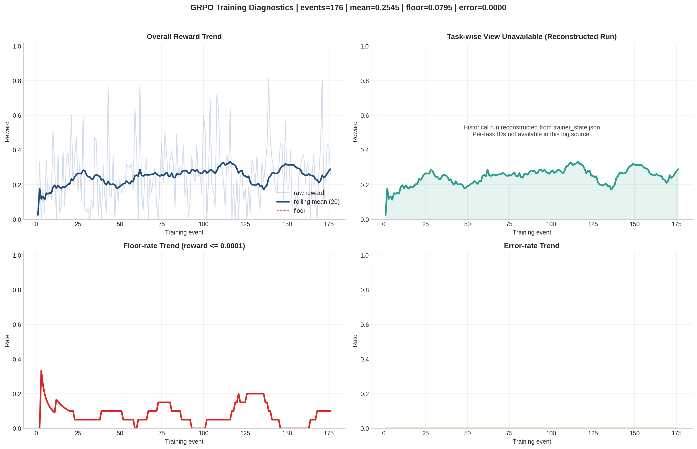

# Medical Triage Environment v2.3.0
## Executive Slide Deck — Team Falcons
### Meta × Scaler PyTorch Hackathon 2026

> **Format:** 10 slides · executive narrative  
> **Style:** high-signal, low-text, inference-first

---

## Slide 1 — The One-Line Story

**We built a clinically grounded RL environment that not only evaluates medical LLMs, but demonstrably trains them end-to-end.**

- 11 tasks · 75 cases · deterministic grading
- Production + staging gates both passing
- GRPO training evidence available and reproducible

---

## Slide 2 — Why This Matters Now

**Clinical AI fails in three predictable ways:**

- Bias across demographics
- Masked deterioration missed by surface-level reasoning
- Must-not-miss diagnoses dropped under ambiguity

**Market gap:** benchmarks mostly score outputs; they do not provide a robust RL training substrate with deterministic reward.

**Our position:** this project closes that gap.

---

## Slide 3 — Product in One View

**What it is**
- OpenEnv-compliant medical triage environment
- FastAPI + Docker + HF Spaces deployment
- Interactive web UI + programmatic client

**What makes it credible**
- Protocol-grounded grading (NEWS2, PEWS, SOFA, SBAR, Sepsis bundle)
- Dense partial-credit reward `(0.0001, 0.9999)`
- Multi-turn deterioration support

**Why this is not theoretical**
- We operationalize multiple real clinical standards, not one:
  - **NEWS2** (adult deterioration escalation)
  - **PEWS** (paediatric deterioration)
  - **SOFA** (ICU organ failure severity)
  - **SBAR** (handover quality and escalation clarity)
  - **Sepsis Hour-1 bundle** (time-critical intervention compliance)
- The grader consumes structured model actions (priority, vitals interpretation, escalation decision, intervention selection, rationale quality) and scores each against protocol-specific rules.
- These protocol scores are fused into a deterministic composite reward with weighted partial credit.
- Result: the RL signal reflects real clinical decision quality across wards, ICU, paediatrics, communication, and sepsis workflows.

---

## Slide 4 — Why the Signal Is Strong

**Reward design principle:** do not collapse to binary pass/fail.

- Partial credit on clinically meaningful dimensions
- Synonym normalization for medically equivalent language
- Session-safe UUID routing for parallel evaluations

**Inference:** better optimization signal for RL, less brittle model feedback loops.

---

## Slide 5 — Difficulty Curve Is Real (Not Synthetic)

**Observed pattern with frontier models:**

- Easy tasks: consistently high
- Medium tasks: selective degradation
- Hard tasks: pronounced drop and variance

**Inference:** this environment discriminates reasoning quality, not just schema formatting.

*[Visual suggestion: one horizontal bar chart with Easy/Medium/Hard grouped means]*

---

## Slide 6 — End-to-End Training Demonstrated

**GRPO + LoRA training run completed against live reward oracle**

- Reward events: 176
- Mean reward: 0.2545
- Floor-rate: 0.0795
- Error-rate: 0.0000

**Inference:** the environment supports real policy adaptation workflows, not static offline scoring only.

---

## Slide 7 — Reliability Story (Production-Grade)

**Validation pipeline**
- Coverage parity
- Local pre-submit gate
- Full browser + API suite
- Release gate with deploy + readiness + live verify

**Latest status**
- Production: PASS (GO)
- Staging: PASS (GO)

**Inference:** strong operational confidence for evaluator reproduction.

---

## Slide 8 — Fairness and Safety Value

**Deterministic fairness grading**
- Same vitals, different demographic descriptors
- Quantified parity score, not subjective review

**Safety-critical hard tasks**
- Masked deterioration
- ICU deterioration
- Differential diagnosis safety-net

**Inference:** this is not a toy leaderboard; it targets high-consequence failure modes.

---

## Slide 9 — Competitive Takeaway

**What differentiates this project**

- Evaluation + training in one coherent system
- Clinically anchored deterministic reward
- End-to-end reproducibility (code, artifacts, gates, docs)

**Strategic insight:** this can be a baseline platform for medical RL research, not just a hackathon demo.

---

## Slide 10 — Demo Flow + Ask

**90-second demo flow**
1. Open web UI
2. Run one medium case (incorrect then corrected action)
3. Show reward jump + breakdown
4. Show training evidence chart and gate summaries

**Call to action**
- Use this as the reference clinical RL environment for safety-centric agent training.

*Live Space · Dataset · GRPO adapter are all available and reproducible.*

---

*Team Falcons — Meta × Scaler PyTorch Hackathon 2026*
